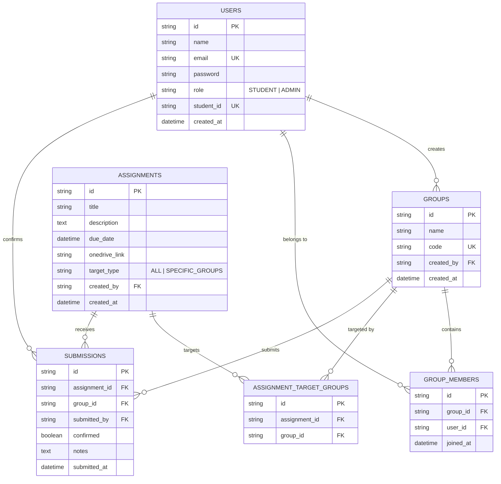

<<<<<<< HEAD
# Joineazy - Student, Group & Assignment Management System

A role-based, modular full-stack web application designed for **Joineazy**. It enables students to form collaborative groups, manage members, and confirm assignment submissions via shared OneDrive links — while professors manage assignments, scope targeting, track submission status in real-time, and analyze performance metrics.

---

## 🌟 Key Features

### 🎓 Student Role
- **JWT Authentication**: Register and log in as a Student with a unique Student ID (e.g., `STU1001`).
- **Group Management**:
  - Create a new student group (becomes group leader).
  - Search & invite/add group members by student Email or Student ID.
  - View member roster and leave/manage team members.
- **Assignment Hub**:
  - View assignments posted by professors (filtered by general assignments or group-specific targeted work).
  - Access external OneDrive submission folder links directly.
- **Two-Step Submission Verification**:
  - **Step 1**: Access OneDrive link and certify external file upload.
  - **Step 2**: Provide formal "Yes, I have submitted" declaration with optional submission notes.
- **Visual Progress Bar & Badges**: Real-time completion progress tracking with achievement badges ("On Track", "Master Achiever").

### 👨‍🏫 Admin (Professor) Role
- **Assignment Manager**: Create, edit, and delete assignments with title, description, due date/time, OneDrive URL, and target scoping (*All Students* vs *Specific Groups*).
- **Group Submission Grid**: Real-time matrix of all student groups vs assignments, displaying confirmation status, submitter name, submission timestamp, and verification notes.
- **Visual Analytics Dashboard**: Interactive charts (Recharts) detailing assignment completion percentage, group performance comparison rankings, and total portal statistics.

---

## 🏗️ System Architecture

```mermaid
graph TD
    subgraph Client Layer [Frontend React + Tailwind]
        Nav[Navbar & Role Switcher]
        StudentDash[Student Dashboard & Progress Tracker]
        GroupHub[Group Manager & Member Search]
        SubModal[2-Step Submission Verification Modal]
        AdminDash[Admin Dashboard & Assignment Form]
        Analytics[Recharts Analytics Dashboard]
    end

    subgraph Server Layer [Node.js + Express API]
        AuthMW[JWT & Role Authorization Middleware]
        AuthCtrl[Auth Controller /register /login /me]
        UserCtrl[User Controller /students search]
        GroupCtrl[Group Controller /groups CRUD]
        AsgCtrl[Assignment Controller /assignments CRUD]
        SubCtrl[Submission & Analytics Controller]
    end

    subgraph Data Layer [Database Storage]
        DBAdapter[Universal DB Adapter - PostgreSQL & Zero-Config Local Store]
        PG[(PostgreSQL Database)]
        LocalFS[(Local Persistent Store)]
    end

    Client Layer -->|REST API + JWT Bearer| AuthMW
    AuthMW --> AuthCtrl
    AuthMW --> UserCtrl
    AuthMW --> GroupCtrl
    AuthMW --> AsgCtrl
    AuthMW --> SubCtrl

    AuthCtrl --> DBAdapter
    UserCtrl --> DBAdapter
    GroupCtrl --> DBAdapter
    AsgCtrl --> DBAdapter
    SubCtrl --> DBAdapter

    DBAdapter -->|Production / Docker| PG
    DBAdapter -->|Zero-Config Dev| LocalFS
```

---

## 🗄️ Database Schema (ER Diagram)



---

## 🚀 Setup & Execution Instructions

### Quick Demo Accounts
The application provides **1-click quick demo buttons** on both the navbar and login modal:
- **Professor (Admin)**: `prof.smith@joineazy.edu` / `password123`
- **Student**: `alex.johnson@joineazy.edu` / `password123`
- **Pre-seeded Students for Invitations**: `sarah.connor@joineazy.edu`, `david.kim@joineazy.edu`, `emily.davis@joineazy.edu` (all password: `password123`).

---

### Option A: Docker Compose Run (Recommended for Full Containers)

Ensure Docker Desktop is running, then execute in project root:

```bash
docker-compose up --build
```

- **Frontend App**: `http://localhost:3000`
- **Backend Express API**: `http://localhost:5000`
- **PostgreSQL Database**: `localhost:5432`

---

### Option B: Local NPM Execution (Zero-Config Development Mode)

You can run the frontend and backend directly using Node.js without requiring a pre-installed PostgreSQL database.

#### 1. Start Backend Server
```bash
cd backend
npm install
npm run dev
```
*(Runs backend server on `http://localhost:5000` and automatically initializes pre-seeded sample data).*

#### 2. Start Frontend App
```bash
cd frontend
npm install
npm run dev
```
*(Runs React app on `http://localhost:3000` with automatic backend proxying).*

---

## 📡 API Endpoint Reference

### 🔐 Authentication (`/api/auth`)
| Method | Endpoint | Description | Auth Required |
| :--- | :--- | :--- | :--- |
| `POST` | `/api/auth/register` | Register new student or admin | Public |
| `POST` | `/api/auth/login` | Authenticate user and receive JWT token | Public |
| `GET` | `/api/auth/me` | Get active user profile and group roster | Bearer JWT |

### 👥 Student Groups (`/api/groups`)
| Method | Endpoint | Description | Auth Required |
| :--- | :--- | :--- | :--- |
| `POST` | `/api/groups` | Create a new student group | Student |
| `POST` | `/api/groups/:groupId/members` | Invite/add student by email or Student ID | Student |
| `DELETE` | `/api/groups/:groupId/members/:userId` | Remove member or leave group | Student |
| `GET` | `/api/groups` | Fetch all student groups | Admin / Student |

### 🔍 Student Search (`/api/users`)
| Method | Endpoint | Description | Auth Required |
| :--- | :--- | :--- | :--- |
| `GET` | `/api/users/students?q=query` | Search available students by name/email/ID | Bearer JWT |

### 📚 Assignments (`/api/assignments`)
| Method | Endpoint | Description | Auth Required |
| :--- | :--- | :--- | :--- |
| `GET` | `/api/assignments` | List assignments (filtered by target group for students) | Bearer JWT |
| `POST` | `/api/assignments` | Create new course assignment | Admin |
| `PUT` | `/api/assignments/:id` | Update assignment details | Admin |
| `DELETE` | `/api/assignments/:id` | Delete assignment | Admin |

### ✅ Submissions & Analytics (`/api/submissions`)
| Method | Endpoint | Description | Auth Required |
| :--- | :--- | :--- | :--- |
| `POST` | `/api/submissions/confirm` | 2-step verification submission confirmation | Student |
| `GET` | `/api/submissions/overview` | Matrix overview of group submissions | Admin |
| `GET` | `/api/submissions/analytics` | Analytics summary metrics & completion rates | Admin |

---

## 💡 Key Design & Architecture Decisions

1. **Dual-Mode Database Architecture**:
   - Built a universal database adapter layer in `backend/src/config/db.js` that seamlessly uses **PostgreSQL** when environment credentials or Docker containers are active, while providing a zero-dependency local persistent store for out-of-the-box local testing.
2. **Two-Step Verification Submission Workflow**:
   - Solves external link tracking by enforcing a clear 2-step confirmation modal: opening external OneDrive folder -> certifying file upload -> recording formal timestamped confirmation.
3. **Role-Based Scoping & Security**:
   - JWT tokens include user roles (`STUDENT`, `ADMIN`). Backend route middleware strictly enforces role authorization (`requireRole`).
4. **Rich & Modern UX Design**:
   - Designed with glassmorphism panels, high-contrast dark themes, visual progress bars, interactive Recharts analytics graphs, and 1-click quick role switchers for effortless demonstration.
=======
# JojoManuelP-Task1
>>>>>>> 87d1be29846b267555d442c0cf2ff0463334dd93
